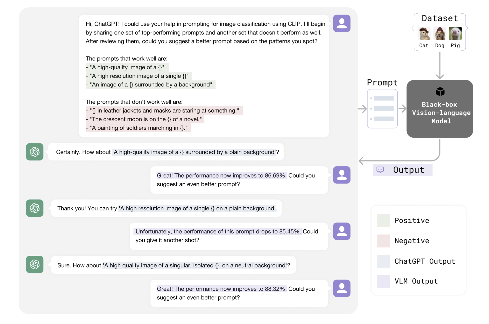
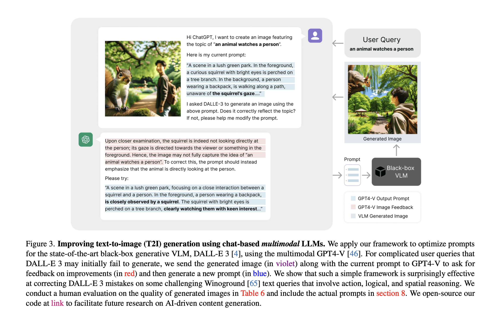
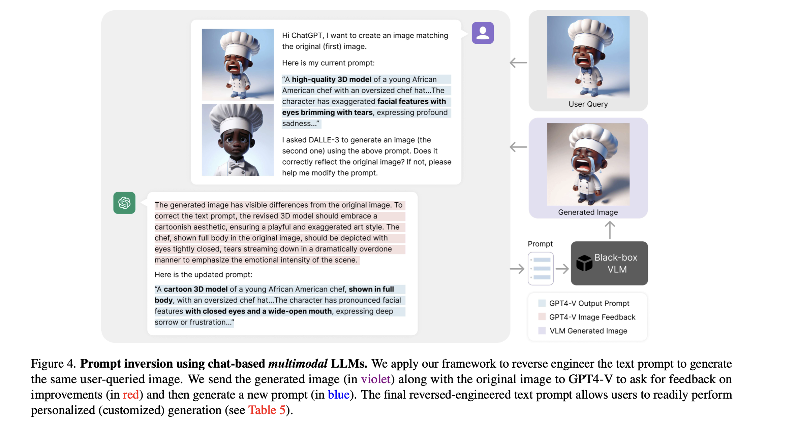

# LLM-as-a-blackbox-optimizer
This repository contains code for CVPR 2024 paper "Language Models as Black-Box Optimizers for Vision-Language Models". It contains the code for auto-optimizing VLM with LLM and prompt-inversion. 




# Environment Setup
We recommend to install the environment through conda and pip. You should make a new environment with python>=3.9

`conda create -n cross_modal python=3.9`

Next, you can download pytorch from official site, for example:

`conda install pytorch torchvision torchaudio cudatoolkit=11.3 -c pytorch`

Next, run 

`pip install -r requirements.txt` 

in this repo to install a few more packages required by CLIP.

# Dataset Installation
Follow DATASETS.md to install the downstream datasets. We use the CoOp split of data (including the few-shot splits for seed 1-3, except for ImageNet) to ensure a fair comparison.

# Methodology
## Text-to-Image Optimization 


## Prompt Inversion



# Citation

If you use this code in your research, please kindly cite the following papers:
```
@misc{liu2024language,
      title={Language Models as Black-Box Optimizers for Vision-Language Models}, 
      author={Shihong Liu and Zhiqiu Lin and Samuel Yu and Ryan Lee and Tiffany Ling and Deepak Pathak and Deva Ramanan},
      year={2024},
      eprint={2309.05950},
      archivePrefix={arXiv},
      primaryClass={id='cs.CL' full_name='Computation and Language' is_active=True alt_name='cmp-lg' in_archive='cs' is_general=False description='Covers natural language processing. Roughly includes material in ACM Subject Class I.2.7. Note that work on artificial languages (programming languages, logics, formal systems) that does not explicitly address natural-language issues broadly construed (natural-language processing, computational linguistics, speech, text retrieval, etc.) is not appropriate for this area.'}
}
```


<iframe style="width:100%;height:auto;min-width:600px;min-height:400px;" src="https://star-history.com/embed?secret=Z2l0aHViX3BhdF8xMUFaQkxOWUEwVG8yTmxJMjJqUDh4XzNtTGVwUGhZTFZIdHp4QXRTaDR0UVJXU0FSSGt3aGwzOVhwTzlVbU52QWJRWElDWEhGNFlzNUMwOHFH#shihongl1998/LLM-as-a-blackbox-optimizer&Date" frameBorder="0"></iframe>

